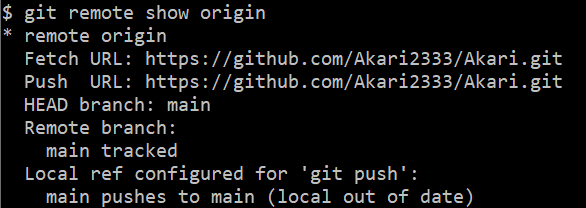

# 1 Error

## 1.1 `unable to get local issuer certificate`

> 1. *[关于使用 git 命令行时遇到的错误消息 unable to get local issuer certificate](https://cloud.tencent.com/developer/article/2138093)*
> 2. *[【Git】SSL certificate problem: unable to get local issuer certificate错误的解决办法-CSDN博客](https://blog.csdn.net/guang_s/article/details/110471236)*

参考以上链接, 以及加上 **Everything** 搜索证书.

## 1.2 `git log` Author字段显示错误

>*[对给git配置邮箱和用户名的理解_git配置邮箱的意义-CSDN博客](https://blog.csdn.net/ITWANGBOIT/article/details/103618427)*

```bash
$ git log
commit 613474e04104bf0b9924a7fed56736f41db4b2f4 (HEAD -> master, origin/main)
Author: Akari2333 <124883319+Akari2333@users.noreply.github.com>
```

1. **查看 / 配置邮箱**

   ```bash
   git config --global user.email
   git config --global user.email "your_email@example.com"
   ```

2. **查看 / 配置用户名**

   ```bash
   git config --global user.name
   git config --global user.name "your_name"
   ```

   

# 2 SSH与密钥

## 2.1 什么是 SSH

SSH（Secure Shell）是一种网络协议，用于在网络上安全地进行远程访问和数据交换。SSH 协议通过加密通信，提供了安全的远程连接方式，可以保护数据在网络上传输时的机密性和完整性。

在使用 SSH 连接时，通常会使用密钥对进行身份验证。这个密钥对包括公钥和私钥：

- **公钥（Public Key）**：公钥是用于加密数据的密钥，可以被分享给他人。当其他人使用你的公钥加密数据时，只有拥有对应的私钥的人才能解密数据。

- **私钥（Private Key）**：私钥是用于解密数据的密钥，必须保持私密，只有你自己知道。私钥用于证明你拥有对应的公钥，从而进行身份验证。

使用 `ssh-keygen` 命令生成的就是 SSH 密钥对，其中 `work_id_rsa` 是私钥，而 `work_id_rsa.pub` 是对应的公钥。私钥通常用于进行身份验证，而公钥则可以分享给其他人或服务端用于验证你的身份。

因此，SSH 不仅仅是密钥，而是一种安全的通信协议，而密钥对则是用于在 SSH 连接中进行身份验证和加密通信的重要组成部分。


## 2.2 生成密钥

```bash
ssh-keygen -t rsa -b 4096 -C "your_email@example.com" -f ~/.ssh/work_id_rsa
```

- <kbd>~/.ssh/name_id_rsa</kbd>: 可以自定义密钥名称

- **私钥**文件在 <kbd>~/.ssh/**id_rsa**</kbd>
- **公钥**文件在 <kbd>~/.ssh/**id_rsa.pub**</kbd>

## 2.3 测试 SSH 连接

测试 SSH 连接是否成功：

```bash
ssh -T git@github.com
```

如果一切设置正确，应该会看到一条欢迎信息 :


这条消息意味着已成功通过 SSH 验证连接到 GitHub，**但 GitHub 并不提供 shell 访问权限**是为了确保安全性，防止用户在 GitHub 上执行任意命令。

## 2.4 查看SSH链接的仓库

查看当前 SSH 连接所链接的仓库，这个命令会显示与本地 Git 仓库关联的远程仓库的 URL ：

```bash
git remote -v
```


另外，如果想要查看当前 Git 仓库的**详细信息**，包括远程仓库的 URL 和其他信息，可以使用以下命令：

```bash
git remote show origin
```

这个命令会显示关于远程仓库 `origin` 的详细信息，包括 URL、Fetch URL、Push URL 等




# 3 git 配置

## 3.1 配置

1. **设置用户信息**
   - `git config --global user.name "Your Name"`
   - `git config --global user.email "youremail@example.com"`
   - **同时也可以更改用户信息**
2. **查看配置信息**
   - `git config --list`

## 3.2 创建仓库

1. **初始化新仓库**
   - `git init`
2. **克隆远程仓库**
   - `git clone <repository_url>`

## 3.3 提交更改

1. **查看文件状态**
   - `git status`
2. **添加文件到暂存区**
   - `git add <file>`
   - `git add .` (添加所有文件)
3. **提交更改**
   - `git commit -m "Commit message"`

## 3.4 分支

1. **创建分支**
   - `git branch <branch_name>`
2. **查看分支**
   - `git branch`
3. **切换分支**
   - `git checkout <branch_name>`
4. **快速切换上一个分支**
   - `git checkout -`
5. **合并分支**
   - `git merge <branch_name>`

## 3.5 远程仓库

1. **添加远程仓库, 将本地 Git 仓库与远程仓库关联**
   - `git remote add origin <repository_url>`
2. **推送本地更改到远程仓库**
   - `git push -u origin <branch_name>`
3. **从远程仓库拉取**
   - `git pull`
4. **查看远程仓库 / 验证远程仓库是否已添加**
   - `git remote -v`

## 3.6 撤销更改

1. **撤销工作目录中的更改**
   - `git checkout -- <file>`
2. **撤销暂存区中的更改**
   - `git reset HEAD <file>`
3. **撤销最近的提交**
   - `git reset --soft HEAD^` (保留更改)
   - `git reset --hard HEAD^` (删除更改)

## 3.7 查看历史和状态

1. **查看提交历史**：
   - 使用 `git log` 查看提交历史。
2. **查看当前状态**：
   - 使用 `git status` 查看当前仓库的状态，包括更改的文件和未提交的更改。