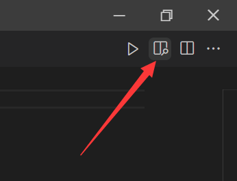

# Markdown基础教学

## 1 简介

### 1.1 为什么有Markdown

-   文本相关的编辑器与文件格式

    -   <kbd>.txt</kbd>格式, 纯文本 ( text )

        -   优点: 直观, 上手方便, 会打字就行, 通用性强
        -   缺点: 不能插入图片表格链接等复杂格式内容, 不能设定某一部分的字体文字大小, 只能显示纯文本

        

    -   <kbd>.doc</kbd>和<kbd>.docx</kbd>格式, Microsoft Office文本文档

        -   优点: 纯文本编辑文件, 文件自动编码为doc相关格式, 因此打字设置格式均相对直观, 用户可实时查看输入内容, 上手方便, 下限高, 适合办公, 受办公软件如WPS, Microsoft Word, Libre Office支持, 可直接查看也可导出pdf
        -   缺点: 编辑和插入公式较困难, 相较其他几种文本格式, 版本兼容性问题较大, 某些正式学术场合较不适用

        

    -   <kbd>.tex</kbd>格式, LaTeX代码文档

        -   优点: 纯文本编辑代码, 专业的排版系统, 规范统一模板后可快速对文档进行排版, 适合排版学术论文, 公式等, 上限极高, 很多学术论文均使用LaTeX相关语言代码排版后编译导出pdf发布
        -   缺点: 上手难, 语法复杂, 需要若干次不同的编译链接等操作才能查看, 较难实时显示改动

        

    -   <kbd>.html</kbd>, 超文本标记语言 (Hyper Text Mark up Language)

        -   优点: 纯文本编辑代码, 用户自主设计空间较大, 适合网页开发与浏览器呈现, 支持读者交互
        -   缺点: 上手难, 有很多 " 特性 " 需要掌握, 如果想要排得视觉效果优秀需要依赖较好的<kbd>.css</kbd>层叠样式表文件 ( Cascading Style Sheets ) 

        

-   <kbd>.md</kbd>格式, Markdown代码文档
    -   上手较简单
    -   支持基本的格式, 如标题, 粗体, 斜体, 下划线, 删除线
    -   插入图片, 代码, 公式等极为方便
    -   可导出pdf, html, latex等多种格式
    -   可自动对代码排版以及高亮显示
    -   支持部分html语言
    -   支持部分LaTeX语言

### 1.2 Markdown与Typora

​		首先, Markdown是一种语言或者一种文本格式, 而将这种格式呈现在我们眼中, 让我们看到排版好文字的物质是编辑器. Typora是一种常用的Markdown编辑器

​		该软件目前收费, 但我有一版免费旧版本安装包, 在我的个人主页http://home.ustc.edu.cn/~yssickjgd下载, 下载后直接默认安装即可


## 2 Markdown教学

-   细节注意

    -   自动匹配括号和字符, 使打字更方便高效

        

    -   插入图片优先使用相对路径, 便于分享等操作

        

    -   切换输入法为中文半角输入, 系统默认输入法可以通过<kbd>Ctrl</kbd>+<kbd>.</kbd>切换

        -   大一上全校通修C语言, 大家应该能意识到大多数计算机语言是不识别中文编码的, 而md也不例外
        -   编辑时, 文本是中文, 默认全角标点; 排版相关的控制代码是英文, 默认半角标点, 而编辑器不识别中文标点
        -   因此切换为中文半角输入这个折中策略, 可以避免了很多时候需要中英文输入法的切换
        -   ( 建议自学一下字符编码和全角半角相关概念 )

### 2.1 基本文本格式

#### 2.1.1 标题

```markdown
# 这是一级标题
## 这是二级标题
### 这是三级标题
#### 这是四级标题
##### 这是五级标题
###### 这是六级标题
####### 这不是七级标题
```

#### 2.1.2 字体

```markdown
**两个星号对之间的内容是粗体的**
*一个星号对之间的内容是斜体的*
_一个下划线对之间的内容也是斜体的_
***三个星号对之间的内容是粗斜体的***
`一个反引号(键盘上1左侧的那个按键)对之间的内容是粗阴影的`
xyz~一个波浪号对之间的内容是下标小写的~xyz
xyz^一个尖号对之间的内容是上标小写的^xyz
==两个等号对之间的内容是高亮的==
```

-   Typora中
    -   <kbd>Ctrl</kbd>+<kbd>B</kbd>是**粗体**
    -   <kbd>Ctrl</kbd>+<kbd>I</kbd>是*斜体*
    -   <kbd>Ctrl</kbd>+<kbd>U</kbd>是<u>下划线</u>

#### 2.1.3 分割线

```markdown
---
```

### 2.2 引用与注释

```markdown
> 这是一段话, 可以当引用或注释使用, 在导出pdf等其他格式时可见
<!--这是一段话, 是注释, 在导出pdf等其他格式时不可见-->
```

### 2.3 列表

#### 2.3.1 无序列表

```markdown
- 这是无序列表的一项
* 这也是无序列表的一项
- 上面那两句话是等价的
* 也就意味着你用减号还是星号加空格都是一样的效果
- 我喜欢用减号, 因为不用按shift键, 懒
```

#### 2.3.2 有序列表

```markdown
1. 这是有序列表的一项
2. 这是有序列表的第二项
3. 不要打这一行字, 按下回车会自动弹出第三项的开头
4. 无序列表其实也同理
```

### 2.4 链接

#### 2.4.1 文章内跳转

-   跳转就像传送门, 要有两个结构, 一个是传送门的入口, 一个是传送门的出口
-   每组传送门要有唯一的id用于标识, 防止跑错
-   有以下两种常见传送门方式

```markdown
<!--下面的内容指定了跳转的动作, 相当于创建了一个传送到id为"test"传送门出口对应地点的传送门入口, 我们需要把这句话放在传送门的起点-->

[<该跳转的名称>](#<传送门出口的id>)

<!--下面的内容指定了跳转目标位置, 相当于创建了一个id为"test"的传送门出口, 我们需要把这句话放在传送门的终点-->

<a id="<传送门出口的id>"></a>

<!--这种情况下传送门入口可以有很多, 但出口只能有一个-->
```

```markdown
<!--下面的内容用于脚注跳转, 跳转的名称为数字序号-->

这需要脚注跳转[^<脚注跳转id>]

<!--下面的内容用于脚注跳转的目标-->

[^<脚注跳转id>]: 跳转的目标

<!--这种情况下原则上传送门入口和出口都只能有一个, 但实际上入口可以有很多, 但会跳来跳去比较乱-->
```

<a id="2.4.2 文件"></a>

#### 2.4.2 文件

```markdown
[<该文件的名称>](<该文件的路径>)
```

-   输入的文件路径, 可以是绝对路径也可以是相对路径
    -   Windows系统下绝对路径开头为盘符, 如<kbd>C:/Users/<你的用户名>/Desktop</kbd>表示桌面路径
    -   Linux系统下绝对路径开头为<kbd>/</kbd>, 如<kbd>/home/<你的用户名>/Desktop</kbd>表示桌面路径
    -   相对路径中
        -   <kbd>./</kbd>表示当前路径, 开头不加亦可表示当前路径
        -   <kbd>../</kbd>表示上一层路径
-   在Typora中
    -   \ 和 / 在表示路径时是等价的
    -   对于非图片类的文件, 也可以直接将其拖动到编辑器中, Typora会自动解析成md格式的代码
    -   按住<kbd>Ctrl</kbd>+<kbd>鼠标左键单击</kbd>可以直接访问该文件
    -   按住<kbd>Ctrl</kbd>+<kbd>K</kbd>可以快速生成链接
-   规律与技巧
    -   对于需要共享出去的文件, 建议使用相对路径指明
    -   其实也可以用此方法链接到非文件的路径, 即文件夹路径
    -   其实也可以用此方法链接到网络的路径, 即网址
        -   对于网址, 直接把链接输入亦可, Typora会自动识别成网络链接
        -   其实网址本质上也是文件, 我们访问目标网址, 其实就是目标网址上对应的文件经过浏览器解析后呈现出来的

#### 2.4.3 图片

```markdown

```

-   输入的图片路径要求和特点与[2.4.2 文件](#2.4.2 文件)中保持一致
    -   图片也可以用[2.4.2 文件](#2.4.2 文件)的方法链接, 但需要点击打开, 此时与文件一样处理
    -   如果用本章节的链接方式, 即开头加感叹号, 则表明图片直接在md文件中呈现出来
-   图片本身也是文件, 可以是本地路径, 也可以是网络路径

### 2.5 常见的插入内容

#### 2.5.1 目录

```markdown
[TOC]
```

-   是 " Table of Contents " 的缩写
-   自动生成目录

#### 2.5.2 代码

```markdown
​``` C++
int main()
{
	printf("hello markdown!\n");
}
​```
```

#### 2.5.3 表格

-   markdown纯文本写表格很折磨, 我也不打算讲, 感兴趣的同学自行摸索
-   Typora中, 右键文本部分, <kbd>插入</kbd>, <kbd>表格</kbd>, 选择行列数即可
-   可以在表格内进行左右对齐与居中设定, 表格内文字也支持一定的排版
-   表格内部换行, 使用<kbd>Shift</kbd>+<kbd>Enter</kbd>即可

### 2.6 嵌入html语言

-   如果不了解html, 无伤大雅, 这种进阶功能很少用到

-   比如B站的 " 嵌入代码 " 功能, 当然这种嵌入代码只能在导出html等可交互与呈现动画的文件时保存, 导出pdf时会损失掉一定的信息, 就像pdf很难保存ppt的动画一样

    

### 2.7 嵌入LaTeX语言

```markdown
<!--下面的内容用于单独一行的公式-->

$$
x_{1, 2} = \frac{-b \pm \sqrt{b^2 - 4 a c}}{2 a}
$$

<!--下面的内容用于行内的公式-->

这是一行字$ x_{1, 2} = \frac{-b \pm \sqrt{b^2 - 4 a c}}{2 a} $, 前面的内容是行内公式
```

-   该公式书写方式遵循LaTeX标准, 同学们可以记住一些常用的数学符号, 其余的现用现查即可
-   LaTeX的特殊符号大全
    -   https://zhuanlan.zhihu.com/p/472919794

## 3 Markdown与VsCode

-   在VsCode中寻找 " Markdown All in One " 扩展插件, 安装即可

-   用VsCode打开md文件或者新建md文件, 点按如图所示按钮即可同步显示md代码和排版好的文本

    

## 4 总结

-   一款好用的轻量级文本排版编写软件+一门易上手的语言