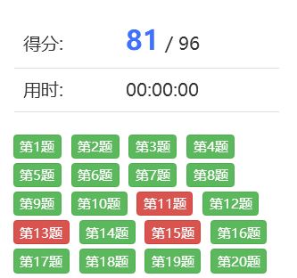
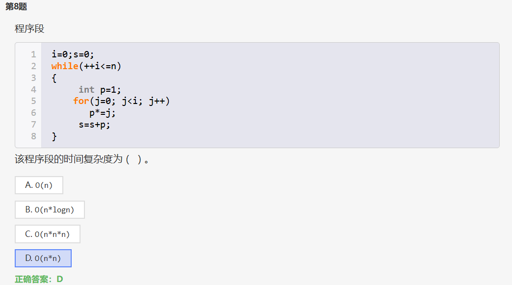
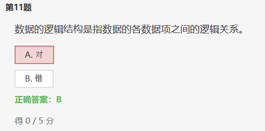
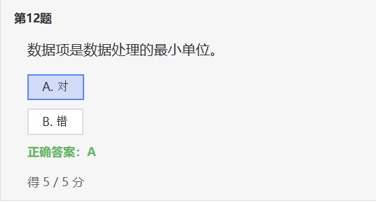
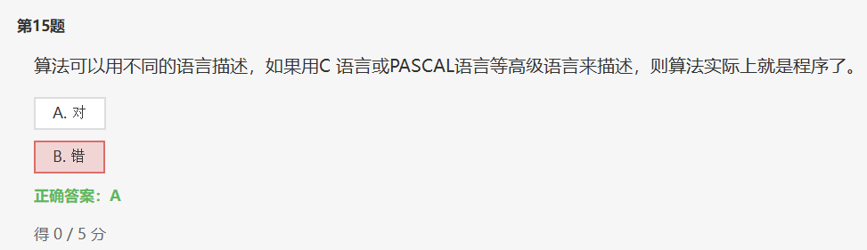

https://www.dotcpp.com/exam/1082/?answer_id=68141

# 1 时间复杂度

# 2 逻辑结构

1. **逻辑结构: 是指数据对象中数据元素之间的相互关系。**

2. **物理结构: 是指数据的逻辑结构在计算机中的存储形式。**

逻辑结构是面向问题的, 而物理结构就是面向计算机的, 其基本的目标就是将数据及其逻辑关系存储到计算机的内存中.

>**逻辑结构**又分为: 1.集合结构 2.线性结构 3.树形结构 4.图形结构
>
>**物理结构**又分为: 1. 顺序存储结构 2. 链式存储结构

 

# 3 数据项

**数据**: 是描述害观事物的符号, 是计算机中可以操作的对象, 是能被计算机识别, 并输入给计算机处理的符号集合.

**数据元素**: 是组成数据的有一定意义的基本单位, 在计算机中通常作为整体处理, 也被称为记录。

**数据顶**: —个数据元素可以由若干个数据顶组成.

> **数据项是数据不可分割的最小单位.**

**数据对象**: 是性质相同的数据元素的集台, 是数据的子集.

**数据结构**: 是相互之间存在一种或多种特定关系的数据元素的集合.

# 4 算法与程序

