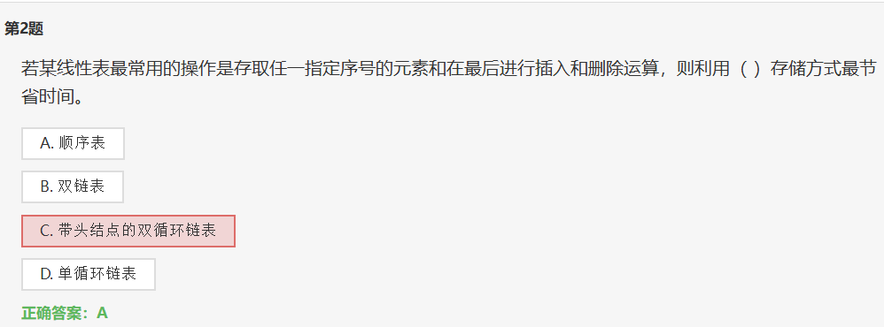

- 做题记录: https://www.dotcpp.com/exam/1081/?answer_id=68143

# 1 no.1

线性表是具有n个  `数据元素`  的有限序列（n>0）。

# 2 no.2

1. 存取任一指定序号: **即顺序结构.** 

   > 在顺序表中，元素的存储位置是连续的，可以通过下标直接访问任意位置的元素，时间复杂度为O(1)，即使是随机访问也非常高效。

2. 在最后进行插入和删除运算：看清楚是 **最后** , 所以是顺序表. 

   不能一看见顺序表**插入, 删除**就觉得是 **O(n)**

   > 在顺序表中，在表的末尾进行插入和删除操作非常高效，时间复杂度为O(1)，因为顺序表的结构使得在表尾进行操作不需要移动其他元素。

3. 至于 `双链表` , `带头结点的双循环链表`, `单循环链表`, 因为题目要求 **任一位置**以及**最后插入和删除**, 所以均不符合. 因为没有说是否有尾节点, 不说默认没有头结点和尾节点. 就算有, 访问任意位置也是 **O(n)**

> 相比之下，双链表、带头结点的双循环链表和单循环链表在存取任一指定序号的元素和在最后进行插入和删除运算时，通常需要遍历链表来找到指定位置，时间复杂度为O(n)，其中n是元素个数。因此，对于频繁进行这些操作的情况，顺序表是最节省时间的选择。

# 3 no.3

> 某线性表中最常用的操作是在最后一个元素之后插入一个元素和删除第一个元素，则采用（  ）存储方式最节省运算时间。
>
> ​	B. 仅有头指针的单循环链表
>
> ​	D. 仅有尾指针的单循环链表

均为**单循环链表**, 而单循环中, 可以通过尾找到头, 不能通过头找尾

# 4 no.4

`C. 带尾指针的单循环链表` 

1. 末尾插入: **O(1)**
1. 删除尾节点: **O(n)**, 单循环, **无法在 O(1) 时间内找到尾节点的前驱节点**

# 5 no. 10

单链表的存储密度（ ）。

**C. 小于1**

>单链表的存储密度是指实际存储的数据所占用的空间与链表节点总空间的比例。在单链表中，每个节点包含两部分信息：数据域和指针域。指针域用来指向下一个节点，数据域用来存储节点的数据。
>
>单链表的存储密度相对较低，主要是因为每个节点除了存储数据外，还需要存储指向下一个节点的指针。这使得单链表的存储密度受到指针占用空间的影响。
>
>具体来说，单链表的存储密度取决于以下因素：
>
>1. 数据域大小：存储的数据大小会直接影响存储密度，数据域越大，存储密度越高。
>
>2. 指针大小：指针的大小取决于系统架构，通常指针大小为4字节或8字节，这部分空间会占用节点空间的一部分。
>
>3. 系统对齐：有些系统会对数据进行对齐操作，可能会导致额外的空间浪费。
>
>总的来说，由于单链表中每个节点都需要存储指针指向下一个节点，因此相比于仅存储数据的结构，单链表的存储密度较低。

# 6 no.16

**可以用数组模拟啊!**

邻接矩阵 树, 图, 不都是??? 算法基础课不都是数组模拟

# 7 no.18

错, 比如 `2 no.2`  数组在尾端插入删除很简单

# 8 no.20

>集合与线性表的区别并不仅仅在于是否按关键字排序，主要区别在于元素的重复性和有序性：
>
>1. **集合（Set）：**
>   - 集合是由一组互不相同元素构成的数据结构，元素无序且不重复。
>   - 集合中的元素没有特定的顺序，不关心元素之间的排列顺序。
>   - 集合通常用于表示一组独立的对象，其中每个对象都是唯一的。
>   - 集合通常支持集合运算，如并集、交集、差集等。
>
>2. **线性表（List）：**
>   - 线性表是由一组元素构成的有序序列，元素可以重复。
>   - 线性表中的元素有顺序关系，每个元素都有其在序列中的位置。
>   - 线性表可以是顺序存储的（如数组）或链式存储的（如链表）。
>   - 线性表通常支持元素的插入、删除、查找等操作。
>
>因此，虽然排序是集合和线性表之间的一个区别，但更本质的区别在于集合中的元素是不重复的且无序的，而线性表中的元素可以重复且有序。

**按关键字排序**: 按关键字排序指的是根据数据项中的某个关键字（key）对数据进行排序。

在数据结构中，通常会有一个关键字用来标识数据项或者用来比较数据项的大小。按关键字排序就是根据这个关键字对数据项进行排序，使得数据项按照关键字的大小顺序排列。