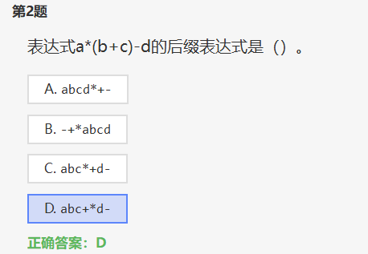
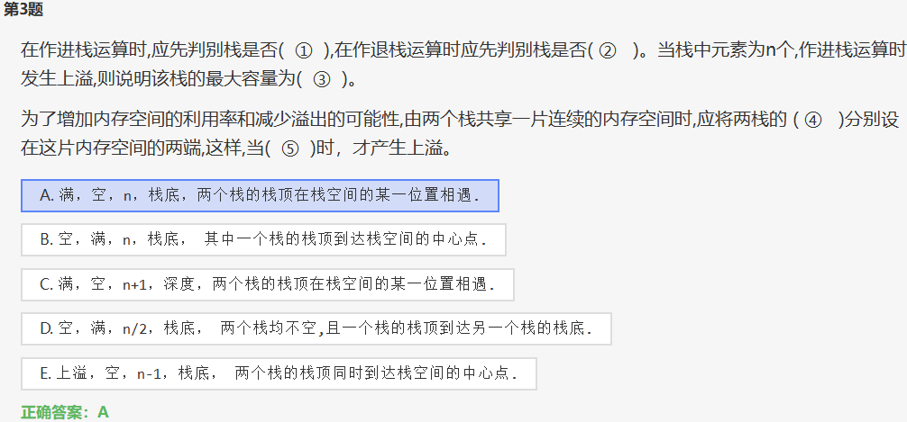
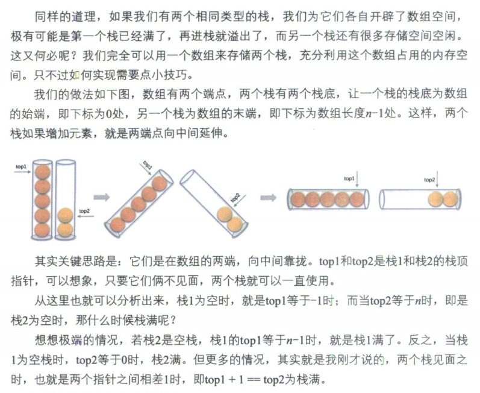
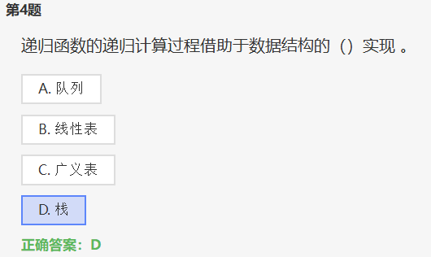
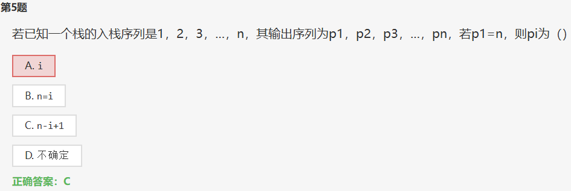
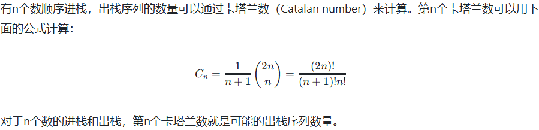
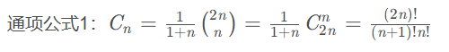

>https://www.dotcpp.com/exam/1080/?answer_id=68149

* [三种表达式 | 数据结构与算法 系列教程（笔记）](https://zq99299.github.io/dsalg-tutorial/dsalg-java-hsp/05/03.html#前缀表达式-波兰表达式)

* [前缀表达式、中缀表达式、后缀表达式总结_(2+3)*5的后缀表达式-CSDN博客](https://blog.csdn.net/xiaoquantouer/article/details/52839001)

* [前缀、中缀、后缀表达式 - 苍青浪 - 博客园](https://www.cnblogs.com/cangqinglang/p/14213456.html)

---

# 1 no.2 后缀表达式

| 中缀 |     $$a*(b+c)-d$$     |  $9 + (3 - 1) * 3 + 10\ /\ 2$   |
| :--: | :-------------------: | :-----------------------------: |
| 后缀 | $a\ b\ c\ +\ *\ d\ -$ | $9\ 3\ 1\ -\ 3 * + 10\ 2\ /\ +$ |
| 前缀 | $-\ d\ *\ +\ c\ b\ a$ | $+\ /\ 2\ 10 + *\ 3 - 1\ 3\ 9$  |

## 1.1 中缀转后缀

要将中缀表达式转换为后缀表达式，可以使用栈来辅助转换。以下是将表达式 $a*(b+c)-d$ 转换为后缀表达式的步骤：

> **也就是用 栈顶操作符 和 当前操作符 比较, 如果栈顶优先级低, 不输出, 进栈**

1. 从左至右扫描中缀表达式的每个元素。
2. 如果是操作数（operand），直接输出。
3. 如果是操作符（operator）：
   - 如果栈为空或栈顶为`(`，直接将操作符入栈。
   - 如果栈不为空，比较当前操作符与栈顶操作符的优先级：
     - 如果 **当前操作符优先级 > 栈顶操作符** ，直接入栈。
     - 否则，将栈顶操作符弹出并输出，直到当前操作符优先级大于栈顶操作符优先级或栈为空，然后将当前操作符入栈。

根据上述规则，将表达式 $a*(b+c)-d$ 转换为后缀表达式的过程如下：

- 输入：$a*(b+c)-d$
- 输出：$abc+*d-$

因此，后缀表达式为  $abc+*d-$

例如, **9 + (3 - 1) *３ + 10 / 2** 转化为后缀表达式: **9 3 1 - 3 * + 10 2 / +**

## 1.2 如何求前缀?

把后缀反过来即可.

## 1.3 三种表达式

中缀表达式、前缀表达式和后缀表达式。

1. **中缀表达式**：
   - 中缀表达式是我们通常使用的表达式形式，操作符位于操作数之间，例如 $a + b$、$a * (b + c)$。
   - 中缀表达式易于人类理解，但在计算机中处理时**需要考虑操作符的优先级和括号的影响**。
2. **前缀表达式**（也称为波兰前缀表达式）：
   - 前缀表达式适合计算机处理，**不需要考虑优先级和括号**，计算时**从右至左**扫描表达式即可。
   - 没有括号的算术表达式，其将运算符写在前面，操作数写在后面。例如表达式 $1-(2+3)$ 的前缀表达式是 $-\ 1 + 2\ 3$。
3. **后缀表达式**（也称为逆波兰表达式）：
   - 后缀表达式中，操作符位于操作数之后，例如 $a\ b +$、$a\ b\ c + *$。
   - 不包含括号，运算符放在两个运算对象的后面，所有的计算按运算符出现的顺序，严格**从左向右**进行（**不再考虑运算符的优先规则**），如： $(2+1)*3$，即 $2 \ 1 + 3 *$

# 2 no.3 共享栈

***为了增加内存空间的利用率和减少溢出的可能性,由两个栈共享一片连续的内存空间时,应将两栈的 ( 栈底 )分别设在这片内存空间的两端,这样,当( 栈满 )时，才产生上溢**。*

- 在这种情况下，应将两个栈的 **栈底** 分别设在这片内存空间的两端。这样，当 **栈满** 时，才会产生上溢。

- 这种数据结构通常被称为**双栈共享空间结构**，也称为**共享栈**。在这种结构中，两个栈共享同一片连续的内存空间，一个栈从数组的**起始位置开始向后增长**，另一个栈从数组的**末尾位置开始向前增长**。这种设计可以最大限度地利用内存空间，并减少溢出的可能性。

# 3 no.4 递归计算

递归函数的递归计算过程通常借助于数据结构中的**栈**实现。当一个函数被递归调用时，每次调用都会将当前函数的状态（包括参数、局部变量和返回地址）压入栈中，然后执行新的函数调用。这样，递归调用的过程就形成了一种类似栈的结构，称为**递归栈**。

递归栈的工作原理类似于普通栈，遵循后进先出（LIFO）的原则。每次递归调用都会将当前函数的状态压入栈顶，直到达到递归的结束条件，然后逐个弹出栈顶的状态并执行相应的操作，直到最终返回结果。

因此，数据结构中的栈在递归函数的递归计算过程中起着非常重要的作用，帮助管理函数调用的状态，确保递归能够正确执行并最终返回结果。

# 4 no.5 入栈出栈

> 说明是入一个出一个, 一一对应, **pi = i**

# 5 no.11 消除递归

11\. 消除递归不一定需要使用栈，此说法对吗？  （  ）

**A. 对**

B. 错

>比如, 函数改写为非递归形式...

一种常见的方法是**使用迭代**（iteration）来替代递归。通过将递归函数改写为迭代形式，可以避免使用栈来管理函数调用的状态。迭代通常需要显式地维护状态信息，而不是依赖于系统的函数调用栈。

另一种方法是使用**队列**（queue）来消除递归。某些递归算法可以通过队列来实现，将递归调用转换为迭代的方式。队列同样可以用于管理状态信息，但与栈不同，队列遵循先进先出（FIFO）的原则。

# 6 no.12 共享栈

12\. 两个栈共享一片连续内存空间时，为提高内存利用率，减少溢出机会，应把两个栈的栈底分别设在这片内存空间的两端。（  ）

**A. 对**

B. 错

> 和上面重复了

# 7 no.13 出栈顺序

13\. 有n个数顺序（依次）进栈，出栈序列有Cn种，Cn=[1/（n+1）]*（2n）!/[(n!)*(n!)]。（  ）

A. 对

**B. 错**

**卡特兰数** 表示的是对于n个节点的二叉树有多少种不同的排列方式，对于栈的进出操作，也可以用卡特兰数来计算

# 8 no.16 递归

16\. 只有那种使用了局部变量的递归过程在转换成非递归过程时才必须使用栈。

A. 对

**B. 错**

递归过程在转换成非递归过程时，通常都需要使用栈，无论是否使用了局部变量。**递归的本质是函数调用自身，每次调用都会创建新的函数帧（包含参数、返回地址和局部变量），这些函数帧会形成一个调用栈。**在非递归版本中，需要用栈来模拟这个调用栈，以保存每次递归调用的状态。

**即使递归函数没有局部变量，它仍然需要保存返回地址和参数，以便能够在处理完子问题后返回到上一层调用。**因此，即使没有局部变量，递归到非递归的转换通常也会使用栈来管理调用的层次结构。

总结来说，无论是哪种递归过程，在转换成非递归过程时，通常都需要使用栈来模拟递归调用的行为。

